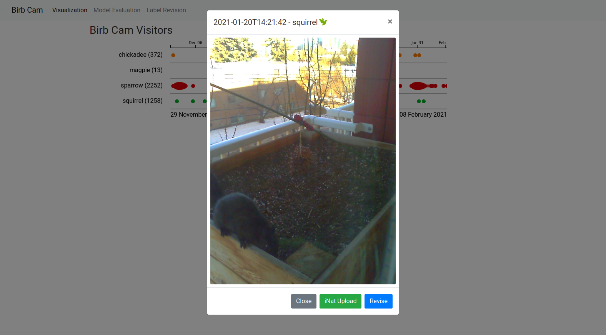
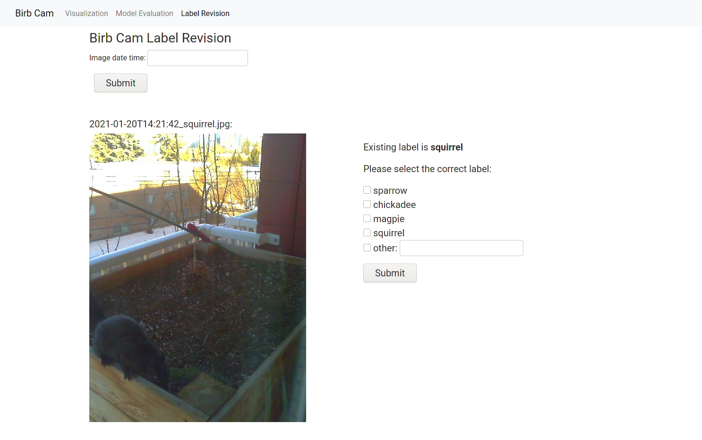
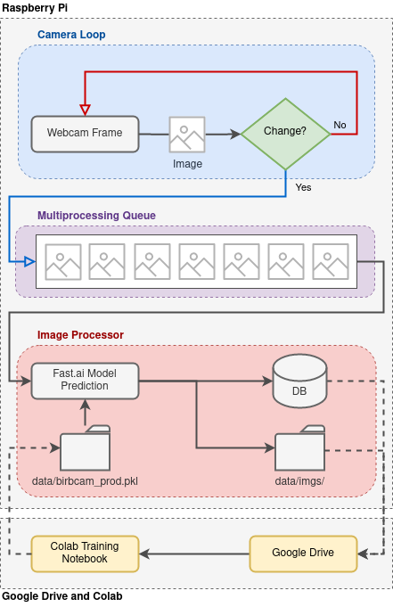

# Birb Cam

A Raspberry Pi project designed to detect animals visiting my balcony with a webcam. Store images from their visits and present the temporal patterns of their visitation in a simple Flask app. Now integrated with iNaturalist to provide community access to select high quality images and observations: https://www.inaturalist.org/observations?place_id=any&user_id=evjrob&verifiable=any

## Setup

1. Install Docker on your Raspberry Pi OS.

2. Clone this GitHub project to your Raspberry Pi

3. Configure your project environment variables in settings.env in the root directory of the project:
    * ROTATE_CAMERA [Boolean] - Rotate the camera by 90 clockwise?
    * CUSTOM_TIMEZONE [String] - The timezone to use. eg. "America/Edmonton"
    * BIRBCAM_LATITUDE [Float] - The latitude of the camera for astral and iNaturalist
    * BIRBCAM_LONGITUDE [Float] - The longitude of the camera for astral and iNaturalist
    * LOCATION [String] - The location name for astral. eg. "Calgary"
    * REGION_NAME [String] - The region name for astral. eg. "Canada"
    * BIRBCAM_INAT_ENABLED [Boolean] - Enable iNaturalist integration? 
    * INAT_USERNAME (Optional) [String] - Your iNaturalist username.
    * INAT_PASSWORD (Optional) [String] - Your iNaturalist password.
    * INAT_APP_ID (Optional) [String] - Your iNaturalist app id string.
    * INAT_APP_SECRET (Optional) [String] - Your iNaturalist app secret string.
    * INAT_POSITIONAL_ACCURACY (Optional) [Float] - The positional accuracy of your camera latitude and longitude in meters.

    If you wish to use the iNaturalist integration, you will need to set up an iNaturalist account and setup OAuth application authentication (https://www.inaturalist.org/oauth/applications/new).

4. Update data/species_map.json to have the species names and details for your Birb Cam. If you wish to use iNaturalist you will need to provide taxa_id for each species.

5. Build the Docker image by running ```docker-compose build --parallel``` in the root of the project. Alternatively, you may pull pre-built images from DockerHub (https://hub.docker.com/orgs/birbcam/repositories). I don't guarantee these images will work, but they may save you some build time.

6. Setup your database by running:

    ```docker-compose run webapp python3 util.py create_db```

7. Train a model for your Birb Cam using notebooks/birbcam_training.ipynb. Further directions can be found in the notebook. I suggest you run this notebook in Google Colab and store your training data in Google Drive to get access to a GPU for free. You may also use notebooks/prepare_new_training_data.ipynb to upload the images you relabeled in the Birb Cam web app directly to Google Drive.

## Running the Project

After completing the above setup, you can start the project by running:

```docker-compose up --detatch```

## Project Structure

1. Web App
1. Camera App
1. Cloud Function 
1. Notebooks

## Web App

A flask based web app used to visualize the images and mode results through time and manually evaluate and revise the labels applied to each image.

### Visualization




### Model Evaluation


### Label Revision



## Camera App

The camera-app directory contains the Python script birbcam.py which runs in perpetuity on the Raspberry Pi 4.



The main() function handles setting up the above architecture in which the camera loop runs during the day time and uses OpenCV to retrieve images from the webcam and then detect if changes have occurred in each new frame. Images with sufficient change are pushed into a multiprocessing queue where the image processor function retrieves them and classifies them using the fast.ai model. Presently this is done using Google Cloud Functions given an issue in which using a PyTorch model trained on x86_64 build in an aarch64 build of the library produces drastically different results. Following classification, the images are saved locally.

## Notebooks

The notebooks contain a variety of experiments and manual workflows for things like preparing new training data.

## Associated Blog Posts

* [Birb Cam - January 23, 2021](http://everettsprojects.com/2021/01/23/birbcam.html)
* [Sharing Birb Cam Observations with the World Through iNaturalist - February 7, 2021](http://everettsprojects.com/2021/02/07/sharing-birbcam-with-inaturalist.html)
* [Birb Cam Grad-CAM - February 15, 2021](http://everettsprojects.com/2021/02/15/birbcam-grad-cam.html)