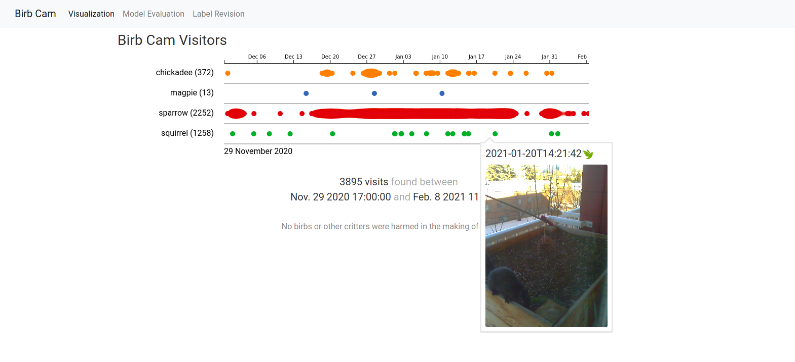

# Birb Cam

A Raspberry Pi project designed to detect animals visiting my balcony with a webcam. Store images from their visits and present the temporal patterns of their visitation in a simple Flask app. Now integrated with iNaturalist to provide community access to select high quality images and observations: https://www.inaturalist.org/observations?place_id=any&user_id=evjrob&verifiable=any


## Running the Project

To start capturing images and classifying them just run the camera-app/birbcam.py script:

```
cd camera-app
python birbcam.py
```

To start the web app I simply use the built in Flask server, since this is just running on my LAN with low traffic:

```
cd webapp/birbcam-app
python -m flask run -h <<LAN IP>> -p 5000
```

If deploying this project on the public internet, please consult the [Flask deployment options documentation](https://flask.palletsprojects.com/en/1.1.x/deploying/).

## Project Structure

1. Web App
1. Camera App
1. Cloud Function 
1. Notebooks

## Web App

A flask based web app used to visualize the images and mode results through time and manually evaluate and revise the labels applied to each image.

### Visualization




### Model Evaluation


### Label Revision


## Camera App

The camera-app directory contains the Python script birbcam.py which runs in perpetuity on the Raspberry Pi 4.


The main() function handles setting up the above architecture in which the camera loop runs during the day time and uses OpenCV to retrieve images from the webcam and then detect if changes have occurred in each new frame. Images with sufficient change are pushed into a multiprocessing queue where the image processor function retrieves them and classifies them using the fast.ai model. Presently this is done using Google Cloud Functions given an issue in which using a PyTorch model trained on x86_64 build in an aarch64 build of the library produces drastically different results. Following classification, the images are saved locally

## Cloud Function

This Python cloud function is used to facilitate model inference while the bugs making inference on the aarch64 builds of PyTorch. Images are passed into the function by converting them into base64 encoded strings and passing them to the REST API endpoint. The endpoint returns a JSON object containing the model inference results.

## Notebooks

The notebooks contain a variety of experiments and manual workflows for things like preparing new training data.


## Associated Blog Posts

* [Birb Cam - January 23, 2021](http://everettsprojects.com/2021/01/23/birbcam.html)
* [Sharing Birb Cam Observations with the World Through iNaturalist - February 7, 2021](http://everettsprojects.com/2021/02/07/sharing-birbcam-with-inaturalist.html)
* [Birb Cam Grad-CAM](http://everettsprojects.com/2021/02/15/birbcam-grad-cam.html)